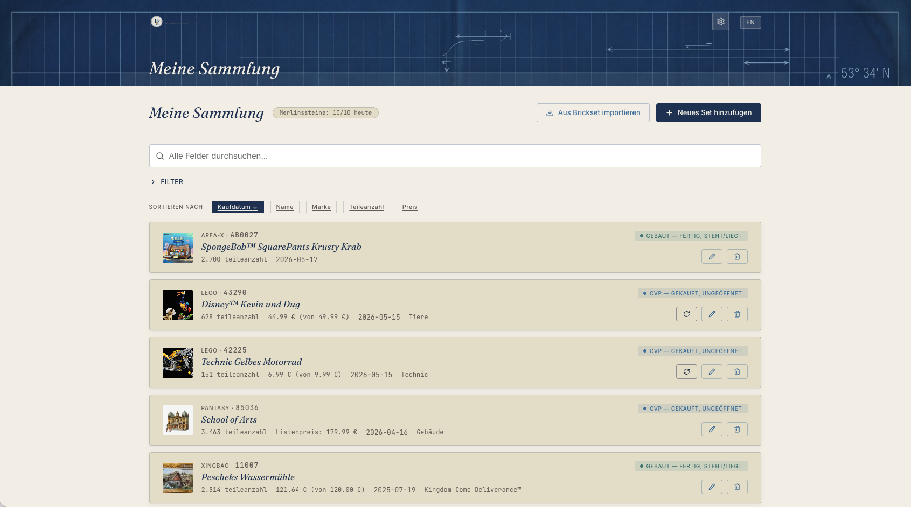
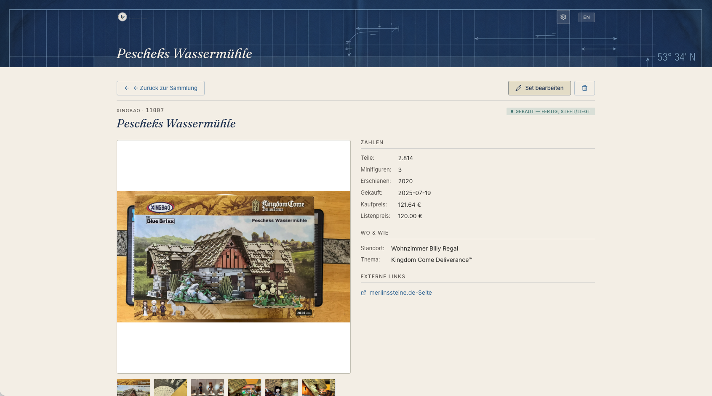
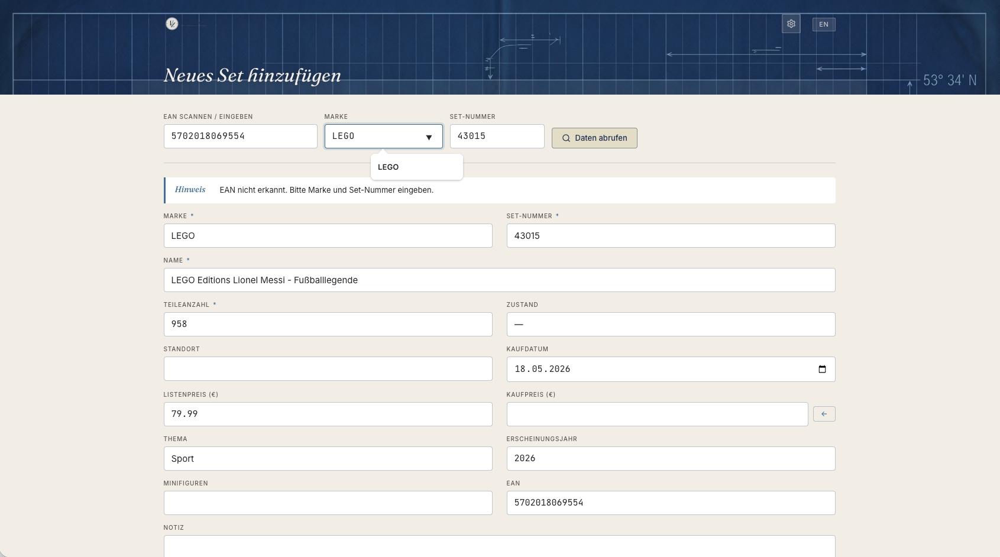
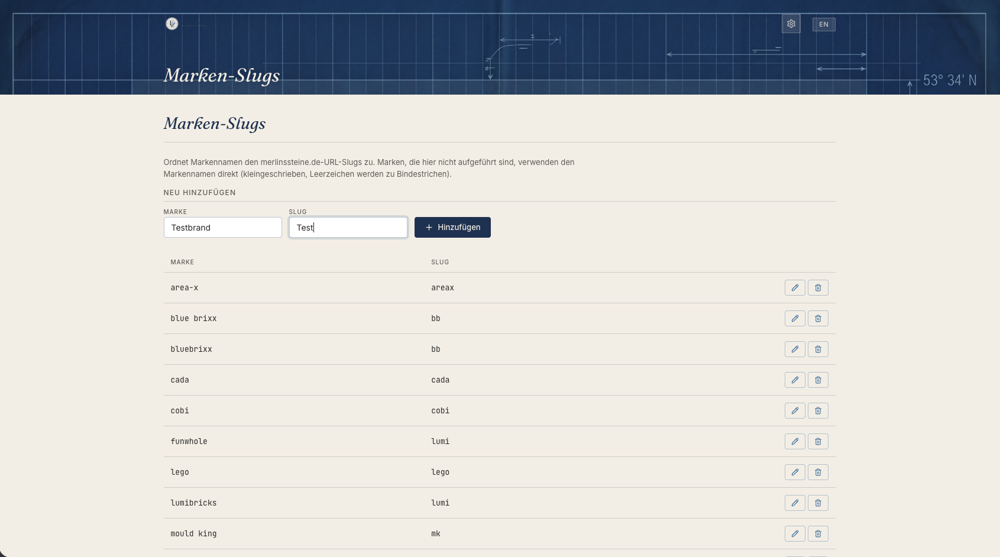
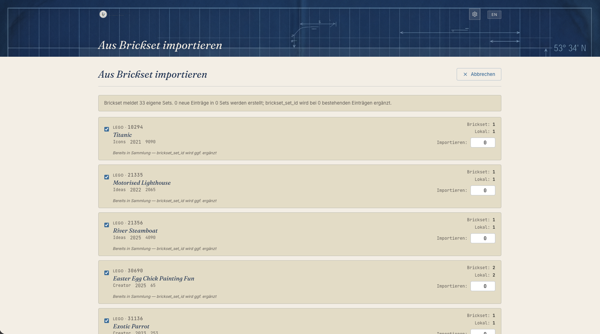

# Brickset Tracker

A local-first SQLite-backed collection manager for LEGO and other brick brands, with Brickset.com integration and a bilingual German/English UI.




## What it is

- A personal collection tracker for LEGO sets and other branded brick sets (Cobi, Lumibricks, Pantasy, MOCs, etc.).
- Local-first: runs entirely on your machine, stores everything in a single SQLite file + a folder of photos.
- Integrates with Brickset.com (when you provide a personal API key) and falls back to scraping merlinssteine.de for German LEGO catalog data.
- Auto-starts at login on macOS via a LaunchAgent.

## What it isn't

- A hosted service. The server binds to `127.0.0.1` only — no LAN exposure, no auth layer.
- A general-purpose inventory tool. Hard-coded around the brick-set domain (brand, set number, part count, etc.).
- Multi-user. One person, one machine.

## Key features

- Sorted + filterable collection list with full-text search across name, brand, set number, EAN, theme, note, location, condition, release year, and part count.
- EAN scan → metadata lookup, with Brickset and merlinssteine.de fallback.
- Bulk import from your Brickset.com collection (auto-detects existing local rows to avoid duplicates).
- Bilingual UI (German primary, English secondary), switchable per session.
- Photo uploads (your own) + automatic web-image fetch (display only — never stored).
- Multi-brand support beyond LEGO, with a configurable brand → URL slug map for the scraper.
- Background LaunchAgent (auto-start at login, auto-restart on crash, automatic free-port discovery).

## Screenshots









## Tech stack

- Python 3.14
- FastAPI 0.115 + Starlette 0.46
- SQLite (stdlib `sqlite3`)
- Jinja2 3.1
- Vanilla JavaScript (no framework, no build step)
- Lucide icons
- Custom "Verklemmt und zugenäht!" design system (handcrafted CSS in `static/style.css`)

## Quick start

```bash
git clone https://github.com/<your-username>/brickset-tracker.git
cd brickset-tracker
python3 -m venv .venv
.venv/bin/pip install -r requirements.txt
cp .env.example .env
# Edit .env to add your Brickset API key + user hash
.venv/bin/uvicorn main:app --port 8000
```

Open <http://localhost:8000/> in a browser. The SQLite database is created on first request.

## Configuration

All configuration lives in `.env` (gitignored). Copy `.env.example` and fill in:

| Variable | Required | Default | Description |
|---|---|---|---|
| `BRICKSET_API_KEY` | yes | — | Get one at <https://brickset.com/tools/webservices/v3/api>. |
| `BRICKSET_USER_HASH` | yes | — | Returned by Brickset's `/login` API after you authenticate. |
| `MERLINSSTEINE_DAILY_LIMIT` | no | `10` | Scrape budget per day before the rate-limit guard kicks in. |
| `PORT` | no | `8000` | uvicorn port. The LaunchAgent installer auto-picks the next free port above this if busy. |
| `BRICKSET_DATA_DIR` | no | (project tree) | Parent directory for `brickset.db` + `uploads/`. Leave unset to keep data inside the project tree. |

## Running it

### Dev mode

```bash
.venv/bin/uvicorn main:app --reload --port 8000
```

The `--reload` flag watches files and restarts on changes. Use only during development.

### Production (macOS LaunchAgent)

Run the server as a background service that auto-starts at login and restarts on crash:

```bash
./scripts/launchagent.sh install
```

The install script also auto-discovers a free port (scanning upward from `PORT` in `.env`) and runs a smoke check. Status and uninstall commands are available — see [`scripts/README.md`](scripts/README.md) for operator details.

## Architecture overview

Three layers, named after a deliberate mnemonic — A.N.T.:

- **A**rchitecture (`architecture/`) — the eight SOPs that define the contract every change has to honour. Read these first if you want to extend the app.
- **N**avigation (`navigation/`) — routing and decision logic. `lookup_router.py` orchestrates EAN-to-set resolution; `set_manager.py` owns add/edit/delete and the search/filter query builder.
- **E**xecution (`execution/`) — deterministic, atomic scripts. `db.py` handles SQLite schema and connections; `photos.py` manages uploads and staging; `brickset.py` and `scraper.py` are the two external integrations.

The constitution lives in [`CLAUDE.md`](CLAUDE.md): data schema, behavioural rules, condition enum, language defaults, architectural invariants.

The SOPs:

- [SOP-001](architecture/SOP-001-add-set-workflow.md) — Add-set workflow
- [SOP-002](architecture/SOP-002-ean-resolution.md) — EAN resolution
- [SOP-003](architecture/SOP-003-merlinssteine-scraper.md) — merlinssteine.de scraper
- [SOP-004](architecture/SOP-004-brickset-api.md) — Brickset API
- [SOP-005](architecture/SOP-005-photo-upload.md) — Photo upload
- [SOP-006](architecture/SOP-006-rate-limit.md) — Rate limit
- [SOP-007](architecture/SOP-007-i18n.md) — i18n
- [SOP-008](architecture/SOP-008-database.md) — Database

## Testing

```bash
.venv/bin/python -m pytest -q
```

The project ships with ~159 tests covering route smoke, schema migrations, the Brickset import path, photo lifecycle, and i18n. Test factories are in `tests/factories.py`; the per-test SQLite fixture is in `tests/conftest.py`.

## Project status

- **V1 shipped 2026-05-18**: complete add/edit/delete/list/details/import flows, brand-slug settings, full pytest suite, LaunchAgent deployment.
- Active development for the maintainer's own use; PRs welcome but no guarantees on review timing.
- Iteration history lives in `docs/superpowers/plans/` (specs in `docs/superpowers/specs/`). Every shipped iteration has a spec → plan → execution audit trail.

## Contributing

This is a personal project, but PRs are welcome:

1. Open an issue first to discuss the change.
2. Fork, branch, commit.
3. Follow the spec/plan discipline: every non-trivial change starts with a spec in `docs/superpowers/specs/` and a plan in `docs/superpowers/plans/`.
4. Run `pytest -q` and confirm 0 regressions before opening the PR.

## License

MIT — see [LICENSE](LICENSE).

## Acknowledgments

- [Brickset.com](https://brickset.com) for their API and the LEGO catalog of record.
- [merlinssteine.de](https://www.merlinssteine.de) for the German-language LEGO catalog and the data we scrape as a backup.
- [Lucide](https://lucide.dev) for the icon set.
- [Claude Code](https://claude.com/claude-code) for AI-assisted development.
